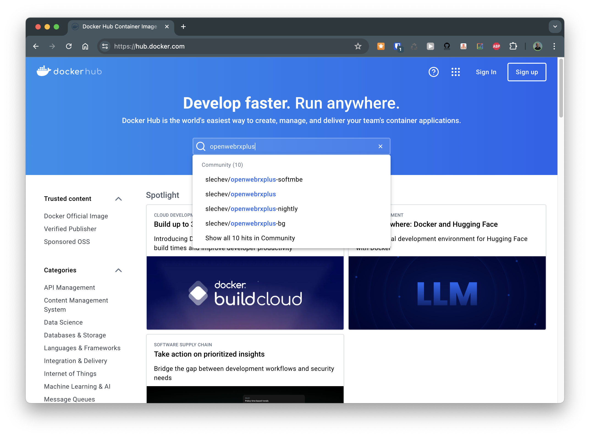
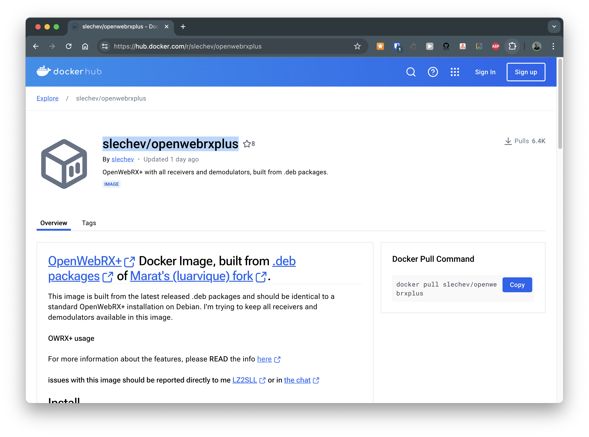
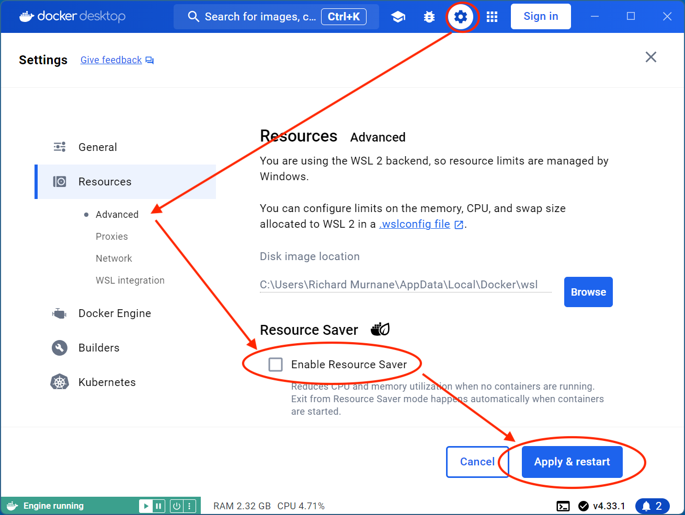
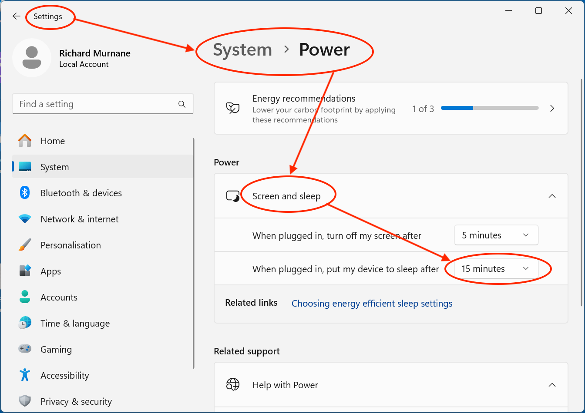

## Windows Installation with Docker

In the book, we installed OpenWebRX+ on a Raspberry Pi, but we can also install it on any platform that can run [Docker](https://www.docker.com). 

In this tutorial we'll install OpenWebRX+ on a Windows machine. A Windows NUC (Next Unit of Computing, a marketing term for "Mini-PC") works well for this purpose, as it is nearly as compact as the Raspberry Pi and, like the Pi, it can be run headless.

The procedure is a little more involved than on the Raspberry Pi, because OpenWebRX+ was designed to run in a *Linux* environment rather than on Windows.

### Docker Images

Docker *images* are templates for building Docker *containers*, which "contain" Linux applications, such as OpenWebRX+. So, our first task will be fetching an OpenWebRX+ image from [Docker Hub](https://hub.docker.com), a repository of Docker images.

### Find the OpenWebRX+ Docker Image

Using your local machine's web browser, go to Docker Hub. Then, in the `Search Docker Hub` box, enter the image name, `openwebrxplus`, to see what's on offer:

From the list of image names, select `slechev/openwebrxplus` (or `slechev/openwebrxplus-softmbe` if you want to include the extra decoders discussed in Chapter 8 of the book): these are the latest *stable* versions of OpenWebRX+. When we click on either name, a new page opens with information about this particular image:

We'll keep this browser tab open, as we need to copy and paste several things from it.

#### SSH into the Windows host

From your local machine terminal application, SSH into the Linux subsystem on the Windows host. Our SSH command needs to include the [`-t` option](https://superuser.com/questions/1622581/ssh-into-wsl-from-another-machine-on-the-network) to access the Windows Subsystem for Linux on the host, as shown below:

~~~ console
➜  ~ ssh vk2sky@openwebrxplus-win.local -t 'wsl ~'
vk2sky@openwebrxplus-win.local's password:

vk2sky@openwebrxplus-win:~$
~~~

Notice that we have a Linux style prompt, instead of the Windows command line.

If we are using PuTTY on our local machine to sign into a Windows host, we need to include our Windows username in the `Host Name` field, for example `vk2sky@openwebrxplus-win.local`. When we click the Open button, we will see the Windows command line prompt on the host. From there, we can enter the command `wsl ~` to reach the Linux subsystem.

#### Pull the OpenWebRX+ Image

Back in our web browser, let's click the `Copy` button in the `Docker Pull Command` section of the OpenWebRX+ image page, and paste the command into our SSH terminal window.

Pulling any image from Docker Hub involves fetching the various *components* that comprise the image. Once we paste in our copied command, we'll see a lot of *Downloading...* and *Extracting...*, but at the end of it our terminal session will look something like this:

~~~ console
vk2sky@openwebrxplus-win:~$ docker pull slechev/openwebrxplus
Using default tag: latest
latest: Pulling from slechev/openwebrxplus
efc2b5ad9eec: Pull complete
cb52165ac64f: Pull complete
89cc5cbcf870: Pull complete
1c1aa691ced9: Pull complete
f9319276d844: Pull complete
ba13f54cb364: Pull complete
de59b5f42dea: Pull complete
2c1f630f30ea: Pull complete
Digest: sha256:996c30e996b2f113f4db68e5289f5f99de23107548c0594afa4aa017f795c957
Status: Downloaded newer image for slechev/openwebrxplus:latest
docker.io/slechev/openwebrxplus:latest
vk2sky@openwebrxplus-win:~$
~~~

The hexadecimal codes for each component will differ, as will the `Digest` value of the composite image. The important thing is that at the end, we see *Status: Downloaded newer image for slechev/openwebrxplus:latest*.

#### Docker Image Vulnerabilities

Sometimes, we might also see a message like this:

~~~ console
What's next:
    View a summary of image vulnerabilities and recommendations
      → docker scout quickview slechev/openwebrxplus
~~~

This is a reminder that when software packages depend on *other* software packages, there is always the possibility of security issues, and Docker images are no exception. The YouTube video,
[*"Never use a Docker container without doing this first! (And don't create one either!)"*](https://www.youtube.com/watch?v=LYzBa_nNqv0) explains the situation well.

It's good to be aware of potential hazards, though in practice most people running OpenWebRX+ don't seem to worry much about it...

We can copy and paste the command, `docker scout quickview slechev/openwebrxplus` into our terminal window to check for any vulnerabilities.

Docker Scout's [Image Analysis documentation](https://docs.docker.com/scout/explore/analysis/) has a lot more information on this topic.

#### "What Could Possibly Go Wrong?"

If we get an error like this:

~~~ console
vk2sky@openwebrxplus-win:~$ docker container ls

The command 'docker' could not be found in this WSL 2 distro.
We recommend to activate the WSL integration in Docker Desktop settings.

For details about using Docker Desktop with WSL 2, visit:

https://docs.docker.com/go/wsl2/
~~~

...it can be caused by Docker Desktop's Resource Saver. To fix that, go to the Windows desktop on the host machine (you may need to attach a keyboard, mouse, and monitor), then go to Docker Desktop's Advanced Settings, clear the *Enable Resource Saver* checkbox, and restart Docker Desktop:

Another possibility is that the Windows computer itself has gone to sleep after a period of inactivity. If this has happened, wake up the machine, go to the Windows System Power Settings, and disable the device sleep timer if necessary:

In the preceding screenshot, the system is set to sleep after 15 minutes: not very useful behaviour for a server! Click on the drop-down list and set Sleep to *Never*.

We can then try the `docker pull` command again.

#### Installing the OpenWebRX+ Image

Back on the OpenWebRX+ Docker Image Details page, let's scroll down to the `Install` section, where we'll find more commands that we'll copy to the host SSH session.

The installation commands at the time of writing are as shown below, but these may change in the future. I'll explain the commands in a moment.

~~~ console
# Create persistent data directories
mkdir -p /opt/owrx-docker/var /opt/owrx-docker/etc /opt/owrx-docker/plugins/receiver /opt/owrx-docker/plugins/map

# Run the container
docker run -d --name owrxp \
    --device /dev/bus/usb \
    --tmpfs=/tmp \
    -p 8073:8073 \
    -p 5678:5678 \
    -v /opt/owrx-docker/var:/var/lib/openwebrx \
    -v /opt/owrx-docker/etc:/etc/openwebrx \
    -v /opt/owrx-docker/plugins:/usr/lib/python3/dist-packages/htdocs/plugins \
    -e TZ=Europe/Sofia \
    -e FORWARD_LOCALPORT_1234=5678 \
    -e OPENWEBRX_ADMIN_USER=myuser \
    -e OPENWEBRX_ADMIN_PASSWORD=password \
    -e HEALTHCHECK_USB_0BDA_2838=2 \
    -e HEALTHCHECK_SDR_DEVICES=4 \
    --restart unless-stopped \
    slechev/openwebrxplus
# (or slechev/openwebrxplus-softmbe)

# add admin user (on another shell)
docker exec -it owrxp openwebrx admin adduser [username]
~~~

Let's break this down:

~~~ console
mkdir -p /opt/owrx-docker/var \
         /opt/owrx-docker/etc \
         /opt/owrx-docker/plugins/receiver \
         /opt/owrx-docker/plugins/map
~~~

The `mkdir`(*make directory*) command creates four directories on the host machine's file system. These directories hold various configuration files used by OpenWebRX+.

~~~ console
docker run -d --name owrxp \
    --device /dev/bus/usb \
    -p 8073:8073 \
    -v /opt/owrx-docker/var:/var/lib/openwebrx \
    -v /opt/owrx-docker/etc:/etc/openwebrx \
    -v /opt/owrx-docker/plugins:/usr/lib/python3/dist-packages/htdocs/plugins \
    --restart unless-stopped \
    slechev/openwebrxplus
~~~

This command tells Docker to do several things:

- create and `run` a container in *detached* mode (`-d`) and give it the name `owrxp`...
- look for devices (like our RTL-SDR dongle, GPS, etc) on `/dev/bus/usb`...
- map port (`-p`) 8073 on the host machine to port 8073 inside the container...
- map the (`-v) volumes or host machine directories we created with the previous command to their corresponding directories inside the container;
- `--restart` the owrxp container automatically on reboot, unless deliberately stop it
- finally, we specify `slechev/openwebrxplus` (or `slechev/openwebrxplus-softmbe`), the image to use as the template for creating the `owrxp` container.

If you're new to Docker, that's a lot to digest; suffice to say that we're starting a Docker container from the OpenWebRX+ image, and mapping its environment inside the container to the host machine's environment.

Finally, this command:

~~~ console
docker exec -it owrxp openwebrx admin adduser [username]
~~~

Tells Docker to execute an OpenWebRX+ command to create an Administrator user. Later we will sign in as this Administrator to change the receiver settings via the OpenWebRX+ admin web page.

You'll want to replace `[username]` in this command with our own administrator name; "`admin`" is a bit too obvious, but that's what I'll use for my example. So the command will become:

~~~ console
docker exec -it owrxp openwebrx admin adduser admin
~~~

At this point, we can hover our mouse over the *Install* code, and click the `Copy` button when it appears, and paste into our SSH session, backspacing over `[username]` and replacing it with our chosen administrator name.

We'll then be prompted to enter the new administrator's password

For my examples, I'm just using the name `admin` and password `admin`. Very insecure in normal use, but these servers are just "burners" and will be long gone or changed by the time this book gets into print!

[aside tip Managing OpenWebRX Administrators]
We can add more administrators using the `docker exec...` command above if we wish, and remove any unwanted administrators in a similar way.

Having more than one administrator means, for example, that we could go on holiday and leave a friend in charge of administration, without revealing our own name and password.

See https://github.com/jketterl/openwebrx/wiki/User-Management for a list of all the admin commands.
[/aside]

#### Blacklisting Host Machine Device Drivers

Blacklisting is not as ominous as it might sound: it simply tells the host machine to ignore specific device drivers that might have been built into the Linux kernel. This lets OpenWebRX+ will use its own instead. The device drivers all relate to SDR radio hardware.

So, on the OpenWebRX+ Docker Image Details page, scroll down past the `plugins` section, down to `Blacklisting device drivers on host`.

The next command that we'll copy and paste creates the file `/etc/modprobe.d/owrx-blacklist.conf` on the host machine, and copies the `blacklist...` lines into the file. Again, hover over the code and click the popup `Copy` button and paste into the SSH session:

~~~ console
vk2sky@openwebrxplus-win:~$ cat > /etc/modprobe.d/owrx-blacklist.conf << _EOF_
blacklist dvb_usb_rtl28xxu
blacklist sdr_msi3101
blacklist msi001
blacklist msi2500
blacklist hackrf
_EOF_
vk2sky@openwebrxplus-win:~$
~~~

Next we'll restart our container, so that the settings above will take effect. In the example below, the command `docker container ls -a` lists the details of all the containers.

~~~ console
vk2sky@openwebrxplus-win:~$ docker container ls -a
CONTAINER ID   IMAGE                          ...etc...   NAMES
ea3d42ccf458   slechev/openwebrxplus:latest   ...etc...   owrxp
~~~

We can see that when Docker create our container, it assigned it an ID of `ea3d42ccf458`. We'll use this in the next command to tell Docker which container we wish to restart.

In this case, since we have only one container, we can get away with referring to it by just the first character of its ID, `e`:

~~~ console
vk2sky@openwebrxplus-win:~$ docker container restart e
e
vk2sky@openwebrxplus-win:~$
~~~

Docker echoes back the abbreviated ID to confirm that it has restarted the container.

> **_NOTE:_** In the preceding example, if we had another container whose ID also started with `ea3`, we would need to refer to ours by at least its first *four* characters, `ea3d`, to distinguish it from any other `ea3...` container.

Back on our local machine, we should now be able to see OpenWbRX+ with our web browser on `http://openwebrxplus-win.local:8073`:

<figure>
  <title>Running on Docker</title>
  <imagedata fileref="images/RunningOnDocker.png" align="center" width="50%"></imagedata>
</figure>

## Onward!

It looks like we have a healthy OpenWebRX+, running on our Raspberry Pi or in a Docker container on our Windows box. It's time to move on to <ref linkend="ch.configuration" /> and check it out!
